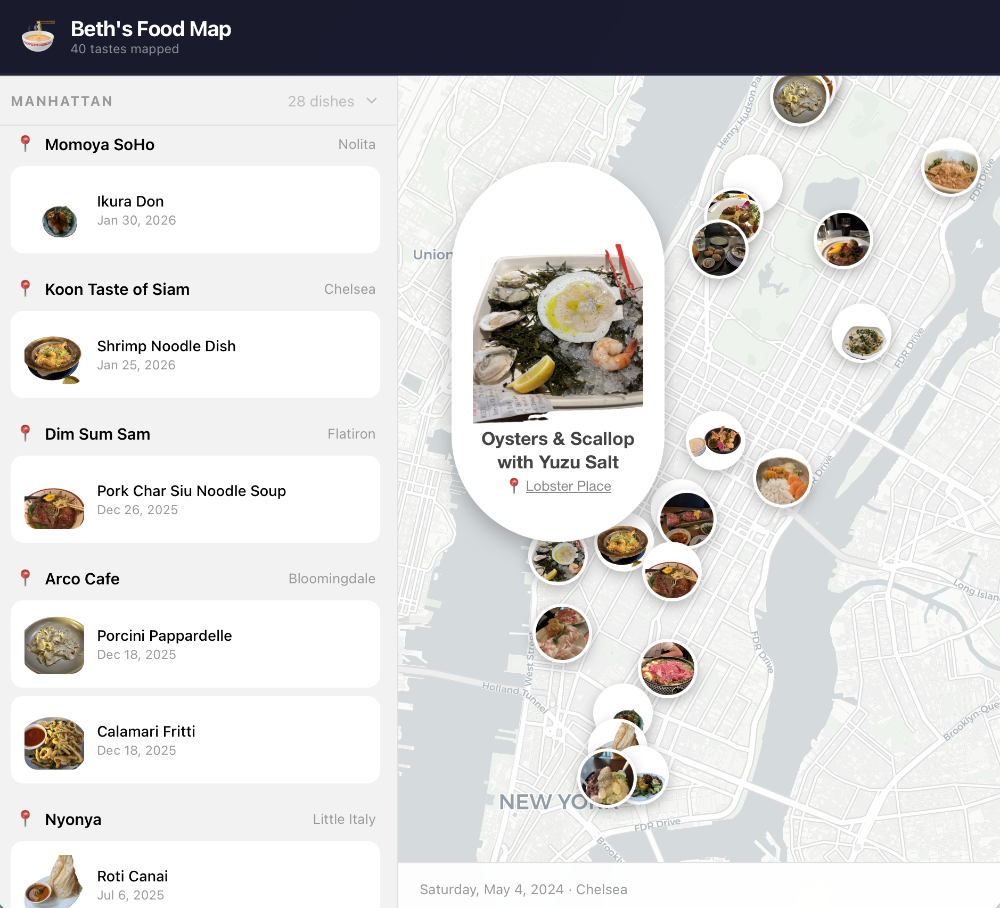

# Food Memory

A mobile-friendly web app that lets you upload food photos and displays them as circular icons on a map at the location where the photo was taken. It extracts GPS coordinates from the photo's EXIF data, removes the background from the food image, and pins it to an interactive map.

